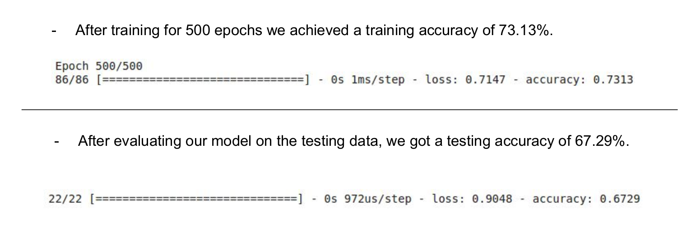
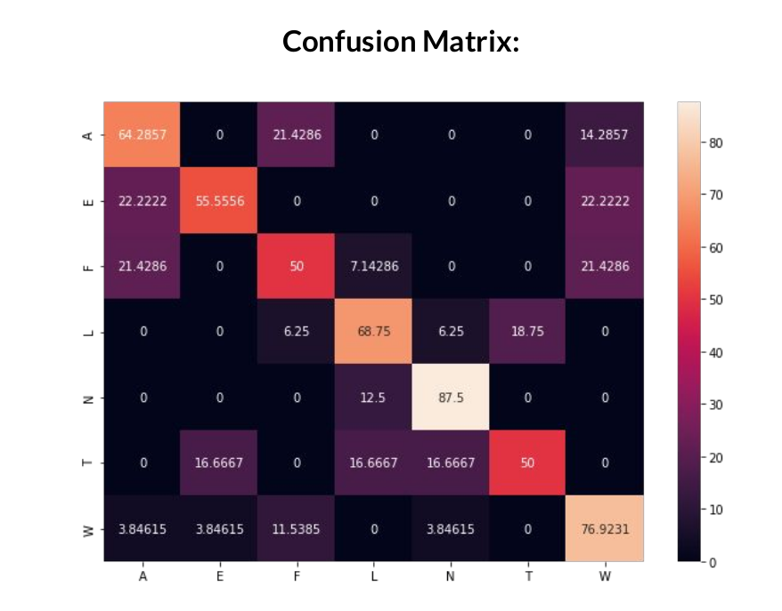

# Speech Emotion Detection using Prosody Features

Project done as part of the Speech Signal Processing (SSP) course of the Monsoon 2020 semester at IIIT-H. 

Teammate: [Dolton Fernandes](https://github.com/doltonfernandes)

## Instructions
1) Copy the EmoDB database from [here](http://www.emodb.bilderbar.info/download/) and extract it inside a folder named 'DB' inside the main directory.
2) Run the following command to restructure the database:
    > python arrangeFiles.py
3) Run the following command to extract prosody features and save:
    > bash  FeatureExtraction/extractFeatures.sh
4) Features will be saved in  FeatureExtraction/features
5) Use these features to run MLP.py or SSP.ipynb as per your setup to generate results.

## Confusion Matrix & Accuracy Results

   
  

